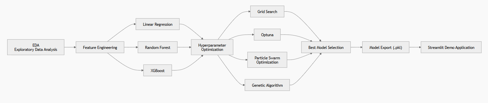
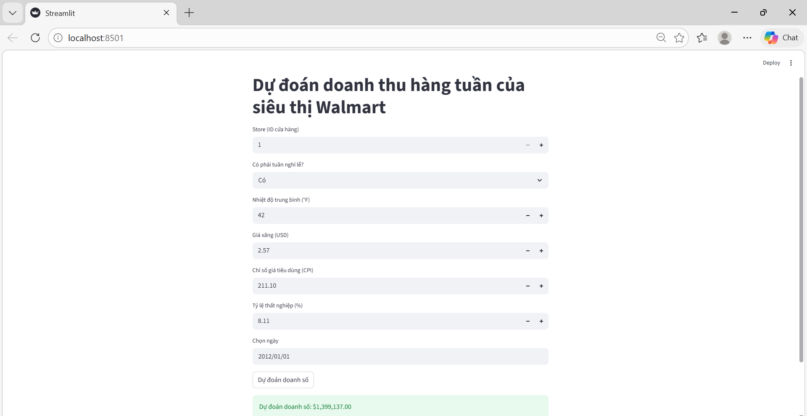

# Walmart Weekly Sales Prediction

Machine learning project that predicts **Walmart weekly sales** using regression models and hyperparameter optimization techniques.  
The project includes **Exploratory Data Analysis (EDA), model comparison, hyperparameter tuning, and an interactive Streamlit demo application**.

**Tech stack**

Python • Pandas • Scikit-learn • XGBoost • Streamlit • Matplotlib

**Hyperparameter Optimization**

Grid Search with K-Fold Cross Validation • Optuna • Particle Swarm Optimization (PSO) • Genetic Algorithm

---

## Overview

This project aims to predict **weekly sales for Walmart stores** using machine learning models and economic indicators.

The workflow includes:

- Exploratory Data Analysis (EDA)
- Feature engineering
- Training multiple regression models
- Hyperparameter optimization
- Model selection
- Deployment using Streamlit

The final trained model is exported as a `.pkl` file and used in a web application to generate sales predictions.

---

## Dataset

Dataset used: **Walmart Store Sales Prediction - Regression Problem**

Features used for prediction:

| Feature | Description |
|------|------|
| Store | Store identifier |
| Holiday_Flag | Whether the week includes a holiday |
| Temperature | Average temperature |
| Fuel_Price | Regional fuel price |
| CPI | Consumer Price Index |
| Unemployment | Unemployment rate |
| Week | Week number |
| Month | Month |
| Year | Year |

Target variable: **Weekly_Sales**

Note:

This project treats the problem as a **supervised regression task** rather than a time-series forecasting problem.  
The dataset is randomly split into **train, validation, and test sets**.

---

## Project Pipeline



---

## Models

The following regression models were evaluated:

| Model | Description |
|------|------|
| Linear Regression | Baseline regression model |
| Random Forest | Ensemble tree-based model |
| XGBoost | Gradient boosting model |

The best performance was achieved using **XGBoost tuned with Optuna**.

---

## Hyperparameter Optimization

Several optimization techniques were explored:

- Grid Search with K-Fold Cross Validation
- Optuna (Bayesian Optimization)
- Particle Swarm Optimization (PSO)
- Genetic Algorithm

Grid Search used **K-Fold Cross Validation** to provide a more reliable estimate of model performance.

Among these methods, **Optuna produced the best validation performance when tuning the XGBoost model**.

---

## Results

The best performing model is **XGBoost tuned with Optuna**.  
Hyperparameters were optimized using Optuna on the validation set.

### Best Model: XGBoost + Optuna

**Best hyperparameters**

- n_estimators: 354
- max_depth: 5
- learning_rate: 0.1975
- subsample: 0.9976
- colsample_bytree: 0.9059
- gamma: 0.2696

**Validation Performance**

| Metric | Value |
|------|------|
| RMSE | 85,512.52 |
| R² | 0.9773 |
| MAE | 52,502.50 |
| MAPE | 5.67% |

The baseline model achieved:

| Metric | Value |
|------|------|
| RMSE | 88,909.12 |
| R² | 0.9755 |
| MAPE | 5.71% |

The optimized XGBoost model improves prediction accuracy compared to the baseline model, achieving lower RMSE and MAPE while maintaining a high R² score, indicating strong explanatory power for the variation in weekly sales.

---

## Model Comparison

| Model | RMSE | R² | MAPE |
|------|------|------|------|
| Linear Regression | 521,583.50 | 0.1555 | 62.18% |
| Random Forest | 116,013.84 | 0.9582 | 5.77% |
| XGBoost (Baseline) | 88,909.12 | 0.9755 | 5.71% |
| XGBoost + Optuna | **85,512.52** | **0.9773** | **5.67%** |

The results show that tree-based models significantly outperform linear regression for this dataset.  
Among all models, **XGBoost tuned with Optuna achieved the best performance**, with the lowest RMSE and MAPE and the highest R² score.

---

## Project Structure

```
ml-walmart-sales-prediction
│
├── app                # Streamlit application
├── notebooks          # EDA and experiments
├── models             # Trained model (.pkl)
├── images             # Figures used in README
├── src                # Training scripts
└── README.md
```

---

## Model Deployment

The final trained model is exported as a `.pkl` file and integrated into a **Streamlit web application**.

Users can input store and economic features to generate predicted weekly sales.

Run the demo locally:

```bash
streamlit run app/app.py
```

---

## Streamlit Demo

Below is the interactive Streamlit application used to generate weekly sales predictions.


